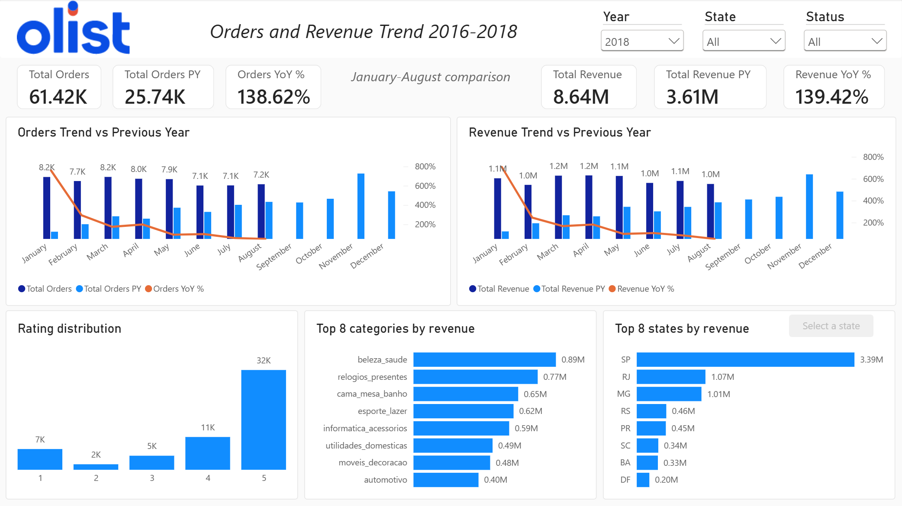
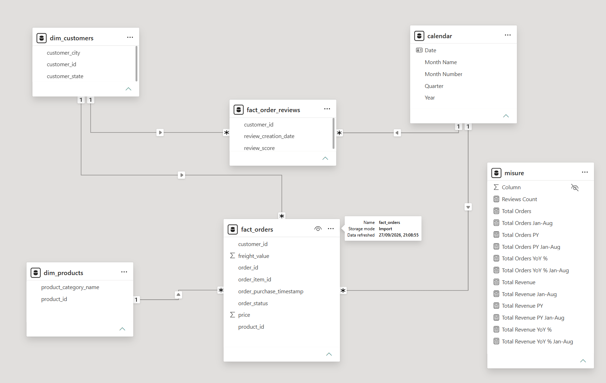
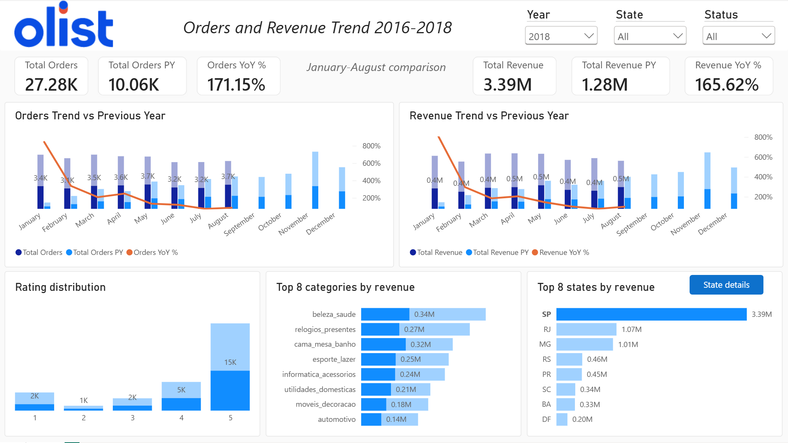

# Report Power BI – E-commerce Olist (2016-2018)

Report Power BI che analizza **ordini**, **ricavi** e **recensioni** dell'e-commerce brasiliano Olist, per stato e confrontati con l'anno precedente.

Progetto finale del modulo Power BI del corso **Epicode – Data Analytics**.



---

## A cosa serve il report

Il report è pensato per un **responsabile commerciale** di Olist che vuole capire:

- in quali **stati del Brasile** si vende di più
- se ordini e ricavi **crescono** rispetto all'anno precedente, mese per mese
- se i clienti sono **soddisfatti** (distribuzione del voto delle recensioni)

Con queste informazioni può decidere, per esempio, su quali stati concentrare le attività commerciali.

---

## Dataset

- **Fonte:** [Brazilian E-Commerce Public Dataset by Olist](https://www.kaggle.com/datasets/olistbr/brazilian-ecommerce) (Kaggle)
- **Licenza:** CC BY-NC-SA 4.0
- **Periodo:** settembre 2016 – agosto 2018
- **Tabelle usate:** orders, order_items, products, customers, order_reviews

I file CSV non sono inclusi nella repo: si scaricano dal link sopra.

---

## Modello dati

Ho usato uno **star schema**: due tabelle dei fatti al centro, le dimensioni intorno.



| Tabella | Tipo | Una riga per... |
|---|---|---|
| fact_orders | Fatti | articolo di un ordine |
| fact_order_reviews | Fatti | recensione |
| dim_customers | Dimensione | cliente (con città e stato) |
| dim_products | Dimensione | prodotto (con categoria) |
| calendar | Dimensione | giorno |

- Tutte le relazioni sono **uno-a-molti** con filtro in una sola direzione.
- La tabella **calendar** è creata in DAX e copre **anni interi** (1 gennaio – 31 dicembre).
- Le misure sono raccolte nella tabella **misure**, divise in cartelle (Orders, Revenue, Reviews).

---

## Preparazione dei dati (Power Query)

- Una query **archive** legge la cartella con tutti i CSV; le altre query partono da lì.
- **fact_orders** unisce ordini e articoli (merge Left Outer su order_id).
- **fact_order_reviews** riceve il customer_id dagli ordini, poi i duplicati vengono rimossi.
- Le query di appoggio (**archive**, **fact_order_item**) non vengono caricate nel modello.
- Ho rimosso tutte le colonne non usate nel report, per **ridurre il volume** dei dati.
- Ho escluso gli ordini **dopo il 31/08/2018**: il dataset in quei mesi è quasi vuoto e falsava il confronto con l'anno precedente.

---

## Misure principali (DAX)

```dax
Total Orders = COUNT(fact_orders[order_item_id])

Total Revenue =
SUMX(
    fact_orders,
    fact_orders[price] + fact_orders[freight_value]
)

-- Stesso periodo dell'anno precedente
Total Orders PY =
CALCULATE(
    [Total Orders],
    PARALLELPERIOD('calendar'[Date], -12, MONTH)
)

-- Variazione % rispetto all'anno precedente
Total Orders YoY % =
IF(
    [Total Orders] > 0,
    DIVIDE([Total Orders] - [Total Orders PY], [Total Orders PY])
)
```

- I **ricavi** sono prezzo + costo di spedizione, come richiesto dalla traccia.
- Le misure **PY** e **YoY %** dei ricavi seguono la stessa logica.
- Le **KPI card** usano versioni "Jan-Aug" delle misure, per confrontare gennaio-agosto di ogni anno.

---

## Pagine del report

**Overview**
- Filtri per anno, stato e status dell'ordine
- 6 KPI card (ordini e ricavi, confronto gennaio-agosto)
- Trend mensile di ordini e ricavi contro l'anno precedente
- Distribuzione dei voti, top 8 categorie, top 8 stati

**State Detail** (pagina di drill-through)
- Mostra il dettaglio di **un solo stato**: stessi indicatori della Overview, più le top 8 città
- Come si apre: nel grafico **Top 8 states** selezioni uno stato e clicchi il bottone **State details**
  (oppure tasto destro sulla barra → **Drill through → State Detail**)
- La pagina **mantiene i filtri** scelti nella Overview (anno e status)
- Il bottone freccia in alto a sinistra riporta alla Overview




---

## Limiti e scelte da conoscere

- **"Orders" conta gli articoli**, non gli ordini (campo order_item_id, come da traccia).
- **775 ordini senza articoli** restano nella tabella ma non entrano nei conteggi.
- **KPI card:** il confronto gennaio-agosto è fisso nel codice, perché i dati 2018 finiscono ad agosto.
- **YoY 2017 vs 2016:** percentuali molto alte perché nel 2016 gli ordini sono pochissimi.
- **Rating:** il filtro anno usa la data della recensione; il filtro status non si applica alle recensioni.

---

## Cosa migliorerei in un contesto aziendale

- Rendere **dinamico** il confronto gennaio-agosto e la data di taglio dei dati.
- Usare un **parametro** per il percorso della cartella dati, invece di scriverlo in ogni query.
- Pubblicare il report su **Power BI Service** con aggiornamento automatico dei dati.

---

## Come aprire il progetto

- **File .pbix** (con i dati inclusi): scaricabile dalla sezione **Releases** della repo. Si apre con Power BI Desktop (Windows).
- **Cartella .pbip** (formato Power BI Project): contiene modello, misure e report come file di testo, leggibili direttamente su GitHub. Per vedere i dati bisogna scaricare i CSV e aggiornare il percorso nelle query.

---

## Strumenti

Power BI Desktop · Power Query · DAX · Git / GitHub

---

*Autore: Federico – corso Data Analytics, Epicode*
